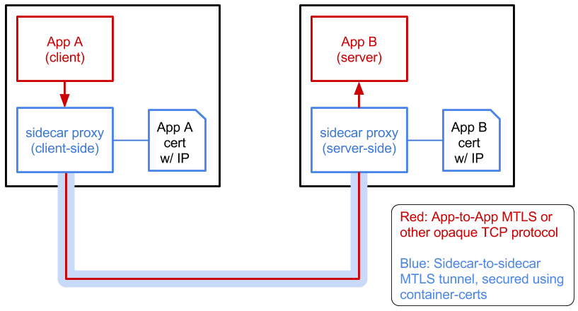

# mtls inception!


Here we show that apps can use in mutual TLS (MTLS) even if their traffic is tunneled through
client-side and server-side sidecar proxies using their own (outer) MTLS connection.

In other words, it's MTLS-inside-MTLS.



To see this in actions, run the following steps in 4 windows

window 1
```
docker run -it --rm -v ~/go:/go golang /bin/bash
```

window 2, 3, and 4
```
docker exec -it $container_handle /bin/bash
```

then from window 1:
```
cd /go/src/github.com/rosenhouse/tls-tunnel-experiments/
./build

bin/server
```

window 2:
```
cd /go/src/github.com/rosenhouse/tls-tunnel-experiments/

bin/server-proxy
```

window 3:
```
cd /go/src/github.com/rosenhouse/tls-tunnel-experiments/

bin/client-proxy
```

and from window 4:
```
cd /go/src/github.com/rosenhouse/tls-tunnel-experiments/
echo "127.0.0.21    server" >> /etc/hosts

echo "hello" | bin/client -address server:7021
```

you should see that the client is able to reach the server and the server returns a reply.
